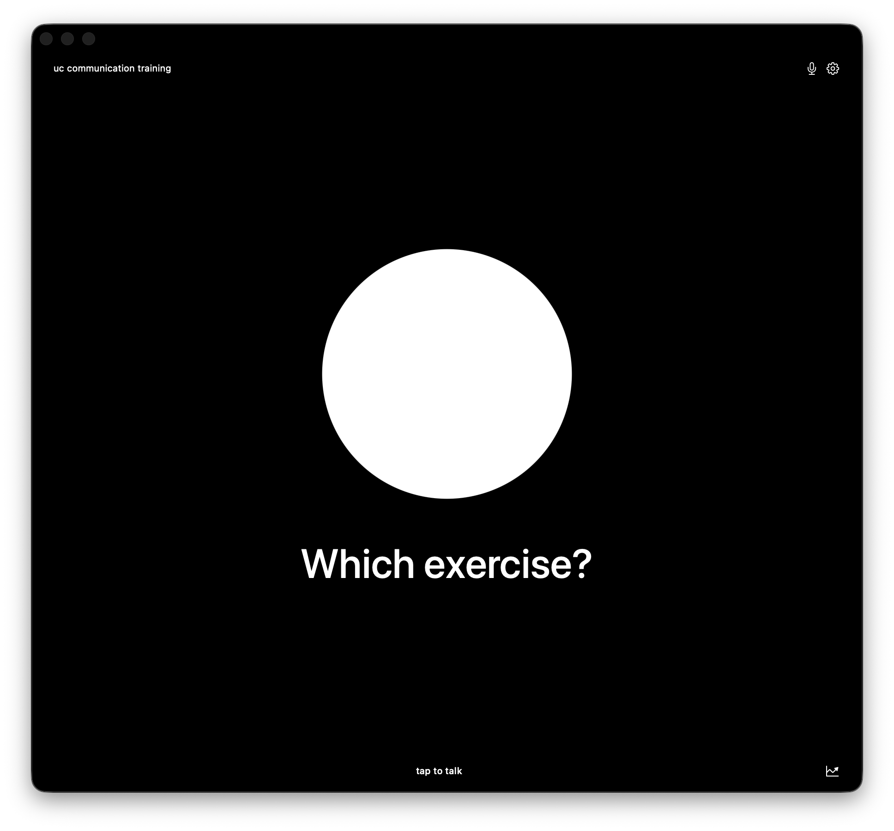

# Karen

Karen is a native macOS voice assistant for Ross, a UC Solutions Architect. v1 is focused on one skill: a UC and AI-automation communication training coach that role-plays scenarios, scores performance on a fixed rubric, and tracks progress over time.



## Requirements

- macOS 14 Sonoma or newer
- Xcode 26 or newer
- Apple Silicon Mac

## Build and Run

Open `Verba.xcodeproj` in Xcode and run the `Verba` scheme. The built app display name is `Karen`.

From the command line:

```sh
./script/build_and_run.sh
```

The project is generated from `project.yml` with XcodeGen. If project settings change:

```sh
xcodegen generate
```

## Status

Phase 0 scaffold is complete. The fixed Realtime model for the app is `gpt-realtime-2`.
